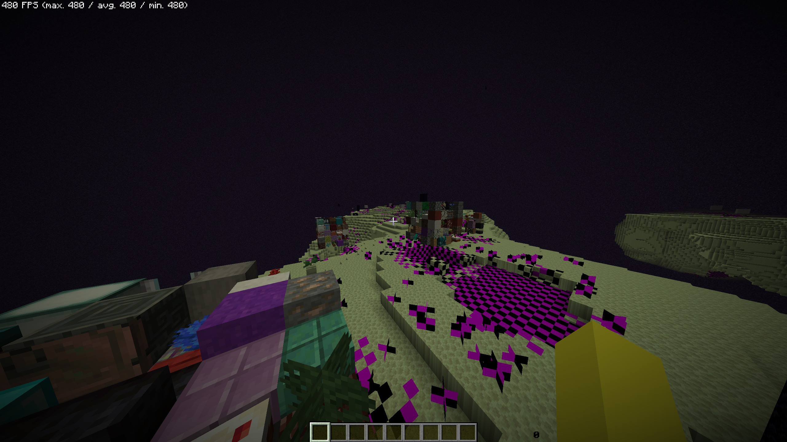
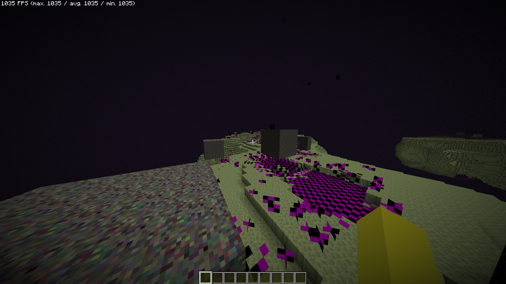

# Biomes Were Already Plenty

Client-side Fabric mod that stops the Anomaly block from Biomes O' Plenty flickering and tanking your FPS.

> Tested on 1.21.1. Will probably work on other 1.21.x versions but no guarantees

## Before / After

| Before                                                                                          | After                                                                          |
|-------------------------------------------------------------------------------------------------|--------------------------------------------------------------------------------|
|  |  |

## What it does

The Anomaly block rapidly cycles through random block textures when you get close to it, which tanks your FPS. This mod
makes it show its own texture instead.

## Config

Via Mod Menu or `.minecraft/config/biomes-were-already-plenty.json`

| Option                       | Default | Description                                            |
|------------------------------|---------|--------------------------------------------------------|
| Fix Anomaly Block Flickering | true    | Stops the block cycling through random block states    |
| Freeze Anomaly Texture       | false   | Freezes the texture on the first frame (requires F3+T) |

## Dependencies

- [Fabric Loader](https://fabricmc.net)
- [Fabric API](https://modrinth.com/mod/fabric-api)
- [Cloth Config](https://modrinth.com/mod/cloth-config)
- [Mod Menu](https://modrinth.com/mod/modmenu) (optional)

## Building

Builds without any extra steps. If you want IDE support for BOP classes, drop a BOP fabric jar into `libs/`  it's
gitignored and not needed to build anyway, it just stops the IDE from displaying evil red texts.

## License

[GPL-3.0](LICENSE)
